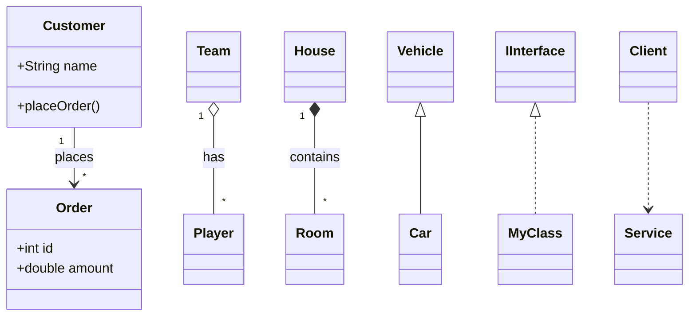

 - [x] 10分読書
 - [x] 技術記事を読む

## 10分読書

引き続き [[books/レガシーコード改善ガイド|レガシーコード改善ガイド]]

P.90の絞り込み点からP.193に言ってちょっと戻って12.1割り込み点から読んでP.171の影響スケッチの項を読んだ。
あとそろそろクラス図ちゃんと振り返っておくかと思ってChatGPTにmermaidを書いてもらった

mermaid記法も覚えた方が良さそうだなー。AIこれ読めるのかな。AIが読めるなら人間はプレビューで図として見られてAIもテキストとして読めてお互い楽になったりしないかな。書くの面倒くさそうだな……
設計書の重要性が上がっていくならUMLも振り返った方がいい気はするんだけどどう転ぶんだかなーAI時代

## 技術記事を読む

[ソフトウェアエンジニアがプロダクトにオーナーシップを持てないアンチパターン、構造](https://nekogata.hatenablog.com/entry/2025/09/22/094637)

また別に技術記事ではないな。どうも最近はこういう業務自体の構造の方に興味が寄っているっぽい。

>オーナーシップとは、自分の仕事や役割に対して主体的に関わり、責任を持って行動する姿勢を指します。（引用元: [オーナーシップとは？意味や特徴、リーダーシップとの違いを解説](https://www.persol-group.co.jp/service/business/article/18449/))

ChatGPT曰く:
#### 1. 「-ship」の意味

- **状態・身分・資格**  
    例：
    - `friendship` → 友達である状態、友情
    - `citizenship` → 市民である身分、国籍
- **能力・特質・役割**  
    例：
    - `leadership` → リーダーとしての能力、統率力
    - `sportsmanship` → スポーツマンとしての態度・精神
- **所有・関係**  
    例：
    - `ownership` → 所有すること、所有権
#### 2. 「オーナーシップ」「リーダーシップ」に当てはめると

- **Ownership（オーナーシップ）**  
    「持っている状態」＝単に所有するだけでなく、自分の責任として受け止める態度や心構えも含むことが多いです。  
    → 会社やプロジェクトに対して「自分のものとして責任を持つ」というニュアンスで使われます。
- **Leadership（リーダーシップ）**  
    「リーダーである状態」＝リーダーとしての能力・行動力・判断力などを指します。  
    → ただ単に肩書き上のリーダーではなく、人を導く力全般を表すことが多いです。

たぶん理解した。

オーナーシップが持てないの、個人的な肌感覚で言うと「下手にオーナーシップ/リーダーシップを取ろうとすると全力でそこに甘えてかついろいろ擦り付けてくるやつがいるからではないかという気がしている。
もちろん自分にとって都合のいい場合のみオーナーシップ/リーダーシップを振りかざすなんてことはできない。と同時に、それを知っている人は「全部の責任は取れないからオーナーシップ/リーダーシップを取るのは嫌だ」と考える。周囲の人間も、誰かがオーナーとかリーダーになると、横から口を出すのはなんだか憚られるような気がして、オーナーとかリーダーとかが気難しい鍋奉行のようになってしまって、複数人で分割してそれを支えるというところに行けなかったりする。
あともう一個問題はプレイングマネージャーとかいうやつで、何しろプレイヤーとしてすごい人なのがわかっているので「タスクを巻き取る」という進言もできず、でもプレイングマネージャーは実際のところパンクして首が回らなくなっているし周りにも悪影響が出ている、みたいなやつ。

>善意に見えていたものはもしかしたら「信頼関係のなさ」に見えてくるかもしれない。「とりあえず相談できる」という信頼関係がないものを、「善意」で包んでいないだろうか？

それもあるすごくある。ただ本当に善意の場合もある。善意というか、善意の押し付け。その場合は無碍にすると却って信頼を損なったりする。信頼というか、なんだろうな、無条件に自分が信頼されていないと気が済まない人がおり、そういう人のプライドを傷つけてしまうとたいそう面倒なことになる。なった。若いころに老人を怒らせてひどい目に遭ったことがあった。

レベルを分けてくれるのすごくわかりやすくていいなー。

私は私を道具だと思っているのでプロダクトオーナーというかステークホルダーが何かやりたいって言うならまあそれはこっちも尽力しますよって感じで働いている（いた）けど、これって非エンジニア側から見たら非協力的な態度に見えていたのかも。
機能実現のために詳細詰めてたら「重箱の隅をつつくような揚げ足取りばかりする」って怒られたり相手の意思を尊重しようとしたら「主体性が無い、協力する姿勢が無い」って言われたり、まあインターフェースの話だろうなとは思うんだけど、つくづくコミュニケーションがうまくいかないね。こっちとしては最大限協力する姿勢なんすけどね……

>システムのオーナーシップ「すら」獲得していないエンジニアが、非エンジニアの信頼を獲得できるだろうか？　「あのひと、いつも困り事を"オーナーシップ持って"解決してるよね」というのは、非エンジニアにも見えるものだ。そうして信頼を獲得することではじめて前述の「善意に包んだ遠慮」を壊せるかもしれない

これも逆なんだよな。少なくとも私は「信頼されていない時点で口出しや手出しをしても却って信頼を損なうだろう」と思っている。そして腑に落ちる、全然知らん信頼もしていない人が急に横から口や手を出してくるのは信頼獲得のための挙動だったのかと。うーん。

後あんまり関係ない話、世の中に「親しい人に対しては多少の無礼も許される」を逆にして「失礼をはたらけば親しくなれる」と思っていそうな人間がいるのは知っているし私は「逆だろアホ無礼人間私の視界から失せろ」と思っていたけど、ひょっとしてあれが上手く働くケースもあるのか？よくわからない。人間は難しいな。少なくとも私には不快でしかない。